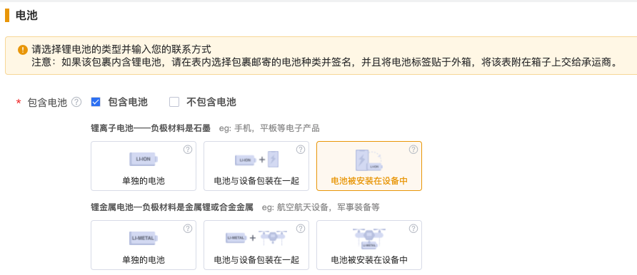

## 新增产品SKU

### 功能介绍
> 该接口功能是创建产品SKU，创建SKU时需要说明该SKU需要支持的服务类型，
> 例如创建支持新机业务和退件翻新业务的产品SKU，服务类型字段type_list=[1, 2, 5]。  
 
### URI
> POST /open/api/v1/add_product

### 请求消息
- 请求参数  
  
  | 参数 | 是否必填 | 参数类型 | 描述 | 最大长度（值） |
  |---|---|---|---|---|
  | type_list | true | Array | 需要BSD支持的服务类型，值只能为：1全新 2翻新 3质检 4报废 5退件 6物料 7维修 8换货 | - |
  | sku | true | String | 产品sku：支持 大小写字母、数字、下划线（_）、中划线（-） | 100 |
  | sku_name | true | String | 产品名称 | 200 |
  | model | true | String | 产品型号 | 200 |
  | product_address | false | String | 原产地 | 200 |
  | quality | false | String | 材质 | 200 |
  | info_url | false | String | 产品信息链接 | 400 |
  | customs_no | false | String | 海关编码 | 200 |
  | declared_value | true | Float | 申报价值,单位美元(USD) | 3000 |
  | cn_declared_name | true | String | 中文申报产品名 | 200 |
  | en_declared_name | true | String | 英文申报产品名 | 200 |
  | score | false | Float | 产品单价,单位美元(USD) | - |
  | warn_num | false | Integer | 预警库存数量 | - |
  | product_desc | false | String | 产品描叙 | 400 |
  | weight | true | Float | 重量 | - |
  | mass_unit | true | String | 重量单位：lb、kg | - |
  | long | true | Float | 长 | - |
  | width | true | Float | 宽 | - |
  | height | true | Float | 高 | - |
  | distance_unit | true | String | 尺寸单位：in、cm | - |
  | battery | true | Integer | 是否包含电池：1是 0否 | - |
  | battery_type | true | Integer | 电池类型：（锂离子电池——负极材料是石墨 eg：手机，平板等电子产品）1单独的电池，3电池和设备包装在一起，5电池被安装在设备中，（锂金属电池—负极材料是金属锂或合金金属eg：航空航天设备，军事装备等）2单独的电池，4电池和设备包装在一起，6电池被安装在设备中 | - |
  | img | true | String | 产品图片地址 | 200 |
  | user_note | false | String | 备注 | 400 |

- 请求示例
  ```json
  {
    "type_list": [1, 2, 5, 7],
    "sku": "TTT0021",
    "sku_name": "测试产品",
    "model": "T002",
    "product_address": "CN",
    "quality": "塑料",
    "info_url": "http://www.xxx.com",
    "customs_no": "",
    "declared_value": 2,
    "cn_declared_name": "测试",
    "en_declared_name": "test",
    "score": 4,
    "warn_num": 20,
    "product_desc": "测试create sku",
    "weight": 12,
    "mass_unit": "kg",
    "long": 13,
    "width": 14,
    "height": 10,
    "distance_unit": "cm",
    "battery": 1,
    "img": "http://dev.besender.com/images/20211118/1637216886FaFmemTi0U.jpeg",
    "user_note": "fix"
  }
  ```
- 电池类型


### 响应消息
- 响应参数
  
  | 参数 | 参数类型 | 描述 |
  |---|---|---|
  | code | Integer | 响应结果 |
  | message | String | 响应信息 |
  | data | Object | 返回数据 |
  | &emsp;&emsp;error | Array | 添加失败的错误信息 |
  | &emsp;&emsp;ok | Array | 添加成功的sku列表 |
  

- 响应示例
  ```json
  {
      "code": 200,
      "message": "Success",
      "data": {
        "error": [
            "SKU(NEW_TTT001211) with service type 1 already exists in BSD system",
            "SKU(RV_TTT001211) with service type 2 already exists in BSD system"
        ],
        "ok": [
            "RT_TTT001211",
            "RP_TTT001211"
        ]
      }
  }
  ```
